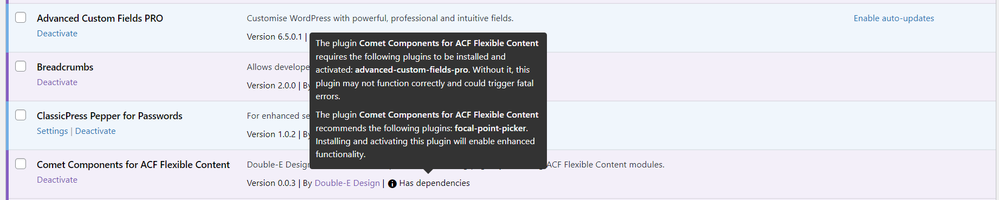

# ClassicPress plugin dependency checker

WordPress provides an option for plugin authors to specify dependent plugins using the "Required plugins" header, but ClassicPress has opted not to implement this feature due to concerns such as interdependencies, version conflicts, etc.

This plugin aims to go some way towards addressing this gap by checking for dependencies and showing warnings on the plugins page. In addition, it provides a way for plugin authors to specify recommended plugins that will enhance the functionality of their plugin, but are not strictly required.

## What it does
- Checks for required plugins for all plugins, using the "Required plugins" header
- Checks for recommended plugins for all plugins, using the "Recommended plugins" header
- Shows an admin notice if a dependency or recommendation is missing
- For each plugin that has dependencies and/or recommendations:
	- Shows a "has requirements" note in the plugin meta in the admin table row with a tooltip providing details of requirements and recommendations
	- Shows a red "unmet requirements" note in the plugin meta in the admin table row with a tooltip providing details of unmet requirements.

## What it doesn't do
- Prevent activation if a plugin has unmet dependencies
- Deactivate plugins if their dependencies are deactivated.
